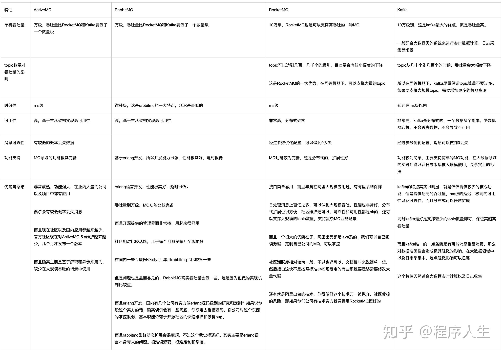

# mq
# message queue

### 1、为什么有消息队列？

编程语言的队列都是简单的内存队列，一般都不是单机，单机挂了，整个系统也会处于不可用状态。
数据持久化、分布式支持等。所以有了各种消息中间件。

也可以思考下为什么需要redis？编程语言已经提供dict、map等

### 2、使用场景：
- 1、生产者与消费者服务解耦，不用关心对方行为。

- 2、异步执行，提供系统吞吐量。
  为什么不用线程池做呢？接口复杂，也是解藕的好处。减少链路长度，排查问题简单。

- 3、消峰、限流

  

  写入消息队列，消费者自己去队列中取。

### 3、消费者消费消息两种工作模式：

  - push
  - pull

  SBA工作采用push方式让，rmq时延非常低。

### 4、SBA场景举例：

  SBA从rmq中收到消息通知就会创建一个协程，未做流量控制，突然涌入很多创建任务的请求，就会对系统造成很大压力。

  港股IPO的令牌桶也是利用队列设计实现的。在创建队列时候，定义了最大队列长度，以及每次创建一个任务的频率（interval）。这样就可以使worker需处理的任务变的均匀。web侧也有一层排队。

### 5、rabbitmq流量控制的方式：

 一个 queue 中消息最大保存量可以在声明 queue 的时候通过设置 x-max-length 参数为非负整数进行指定。

Queue 长度的选取需要考量就绪消息量、被忽略的未确认消息量，以及消息大小。当 queue 中的消息量达到了设定的上限时，为了给新消息腾出空间，将会从该 queue 用于保存消息的队列的前端将“老”消息丢弃或者 dead-lettered 。

prefetch_count配置：当worker未处理结束，不在推送。

### 6、不好的地方

- 系统复杂度，维护中间件，使用注意？
  - 消息消费失败，怎么办？acknowledgement
  - 如何保证数据一致？分布式事务补偿。
  - 消息重复消费
  - 保证消息绝对有序？
  - 如何保证高可用？多主、持久化、rabbitmq的进程模型。

### 6、rabbitmq架构

相关概念：
- 见图

### 7、几种消息队列比较

### 8、rabbitmq的三种工作模式

- direct
- fanout
- topic